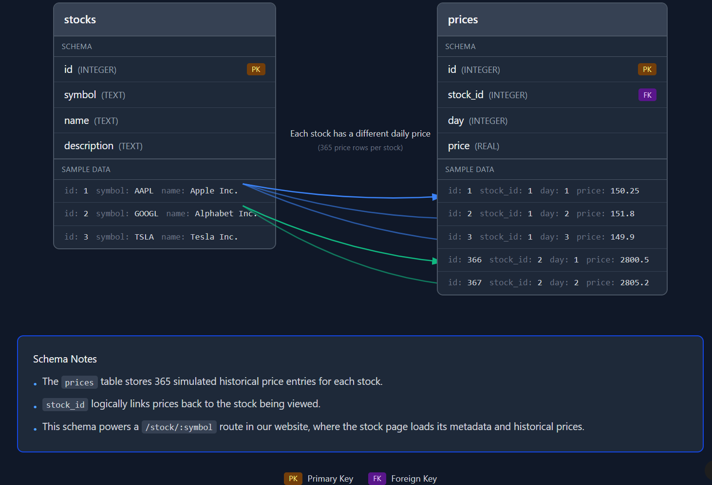

# CSC 317 Final Project: E-commerce Website
### Morgan Bell & Milo Neumann (Group 2)
### Stock Trading Platform

Find our deployed website at https://gatortrade-xe9z.onrender.com/ 

## Backend Database Design

**Schema Diagram (ERD):**  
This diagram represents the database structure used by the backend.  
It shows how our two tables (`stocks` and `prices`) relate to each other in a one-to-many relationship (one stock has many daily price entries).

**Figma Board:**  
https://www.figma.com/make/OAw71m89MRs7huBarIJp2h/Entity-Relationship-Diagram?node-id=0-1&p=f&t=jVHz2jCEi0GkL6Xx-0&fullscreen=1

### Init, Seeding, and Methods

- **Initialization (`data/database.js`)**  
  Creates and configures the SQLite database, defining the `stocks` and `prices` tables.

- **Seeding (`data/seed.js`)**  
  Populates the `prices` table by generating 365 simulated daily price entries for each stock.

- **Database Methods (`server.js`)**  
  Performs queries such as retrieving a stock by symbol and fetching its associated price history, using the schema represented in the diagram above.

